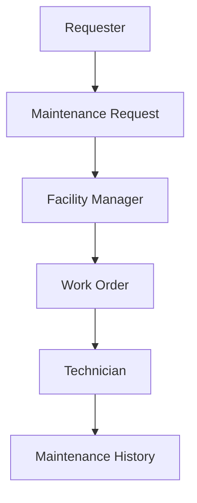
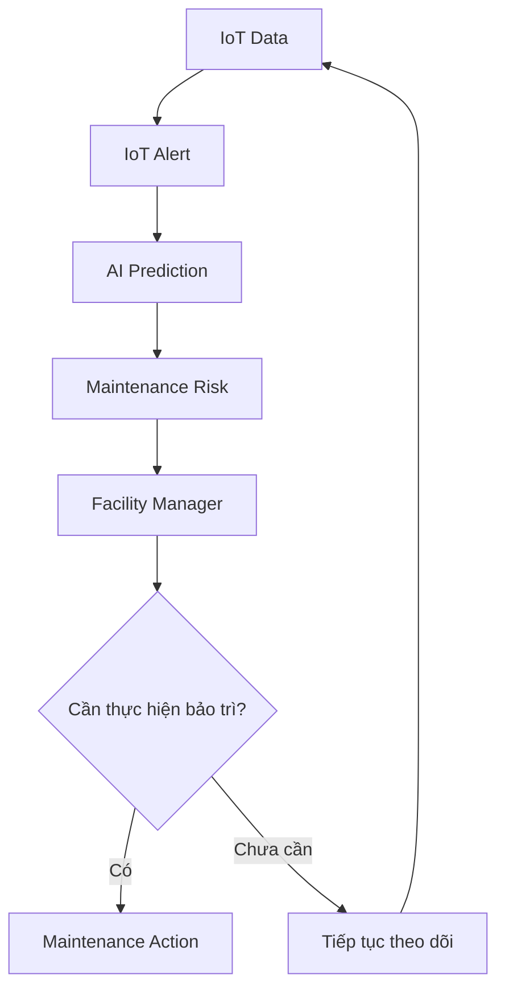

# Business Workflow – Smart Maintenance & Facility Management

## 1. Tổng quan

Hệ thống hỗ trợ quản lý thiết bị, tiếp nhận yêu cầu bảo trì và theo dõi quá trình xử lý tập trung. Bên cạnh việc xử lý sự cố được báo cáo, hệ thống sử dụng dữ liệu IoT và dự đoán AI để hỗ trợ nhận diện nguy cơ bảo trì.

Hệ thống có hai luồng nghiệp vụ chính:

- **Reactive Maintenance:** Bảo trì khi có sự cố được báo cáo.
- **Predictive Maintenance:** Bảo trì dựa trên dữ liệu và dự đoán nguy cơ.

## 2. Các vai trò chính

| Role | Trách nhiệm |
| --- | --- |
| **Requester** | Gửi yêu cầu bảo trì khi phát hiện sự cố và theo dõi tiến độ xử lý. |
| **Technician** | Tiếp nhận Work Order, thực hiện bảo trì và cập nhật kết quả. |
| **Facility Manager** | Quản lý Asset, tiếp nhận Maintenance Request, tạo và giao Work Order, theo dõi hoạt động bảo trì. |
| **Admin** | Quản lý người dùng, phân quyền và cấu hình ánh xạ dữ liệu IoT với Asset. |

**Facility Manager là stakeholder trung tâm của business flow**, kết nối yêu cầu của người dùng, thông tin tình trạng thiết bị và công việc của kỹ thuật viên.

## 3. Reactive Maintenance

### 3.1. Business Workflow

### 3.2. Mô tả nghiệp vụ

| Bước | Nội dung |
| --- | --- |
| 1 | Requester phát hiện sự cố và gửi Maintenance Request cho Asset liên quan. |
| 2 | Facility Manager tiếp nhận và đánh giá yêu cầu bảo trì. |
| 3 | Facility Manager tạo Work Order và giao cho Technician. |
| 4 | Technician thực hiện bảo trì, cập nhật tiến độ và kết quả xử lý. |
| 5 | Facility Manager kiểm tra kết quả và xác nhận đóng công việc. |
| 6 | Kết quả được ghi nhận vào Maintenance History của Asset. |

**Mục tiêu:** Xử lý sự cố đã được báo cáo, theo dõi tiến độ và lưu lại lịch sử bảo trì.

## 4. Predictive Maintenance

### 4.1. Business Workflow

### 4.2. Mô tả nghiệp vụ

| Bước | Nội dung |
| --- | --- |
| 1 | Hệ thống tiếp nhận IoT Data gắn với Asset. |
| 2 | Hệ thống tạo IoT Alert khi dữ liệu đáp ứng điều kiện cảnh báo. |
| 3 | AI Prediction cung cấp kết quả dự đoán để hỗ trợ đánh giá nguy cơ bảo trì. |
| 4 | Maintenance Risk được cung cấp cho Facility Manager để xem xét. |
| 5 | Facility Manager đánh giá thông tin và quyết định hành động bảo trì hoặc tiếp tục theo dõi. |
| 6 | Nếu cần bảo trì, Facility Manager tạo và giao Work Order cho Technician. Kết quả thực hiện được ghi nhận vào Maintenance History. |

**Mục tiêu:** Hỗ trợ Facility Manager chủ động quyết định bảo trì trước khi sự cố xảy ra.

## 5. Nguyên tắc sử dụng AI

> **AI chỉ cung cấp thông tin hỗ trợ. Facility Manager là người quyết định hành động bảo trì.**

- IoT Alert và AI Prediction cung cấp thông tin để đánh giá tình trạng Asset.
- Kết quả dự đoán không tự động phê duyệt hành động bảo trì hoặc tạo Work Order.
- Facility Manager xem xét thông tin trước khi quyết định xử lý.
- Technician thực hiện công việc theo Work Order được giao.

## 6. So sánh hai luồng nghiệp vụ

| Tiêu chí | Reactive Maintenance | Predictive Maintenance |
| --- | --- | --- |
| Điểm bắt đầu | Sự cố do Requester báo cáo | Dữ liệu IoT |
| Đầu vào cho Facility Manager | Maintenance Request | Maintenance Risk |
| Người quyết định xử lý | Facility Manager | Facility Manager |
| Người thực hiện bảo trì | Technician | Technician |
| Mục tiêu | Xử lý sự cố đã được báo cáo | Chủ động bảo trì dựa trên nguy cơ |
| Kết quả khi thực hiện bảo trì | Ghi nhận vào Maintenance History | Ghi nhận vào Maintenance History |
