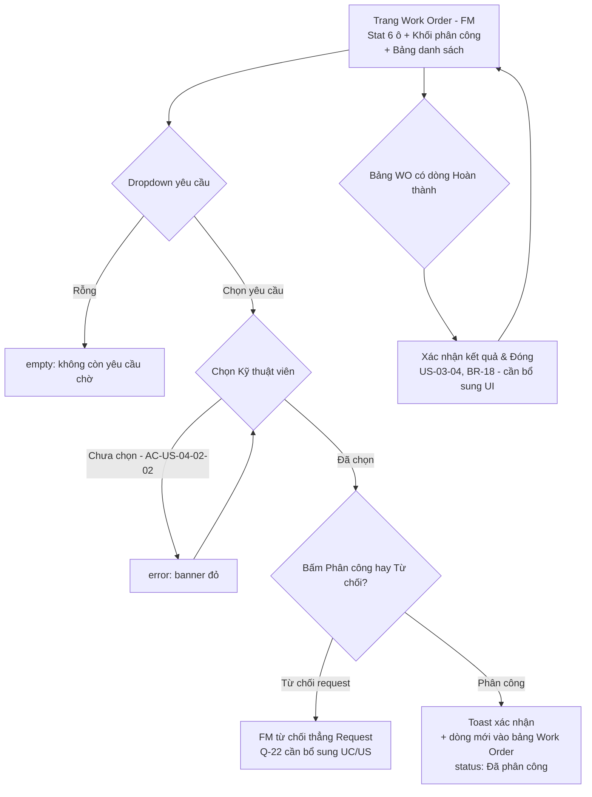
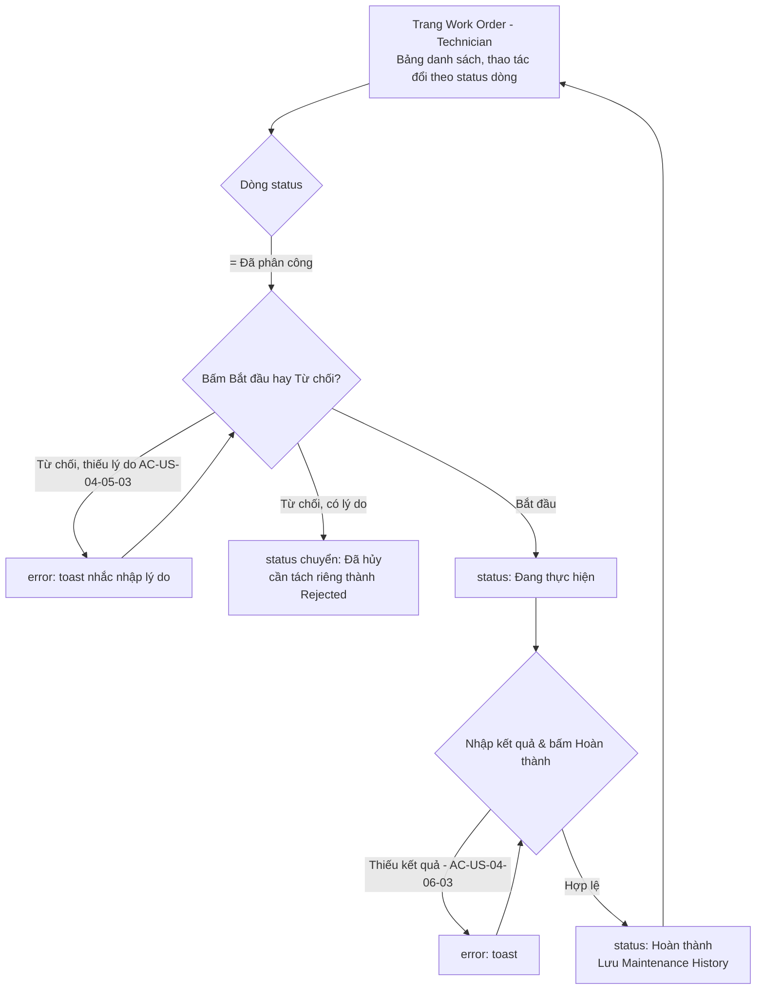
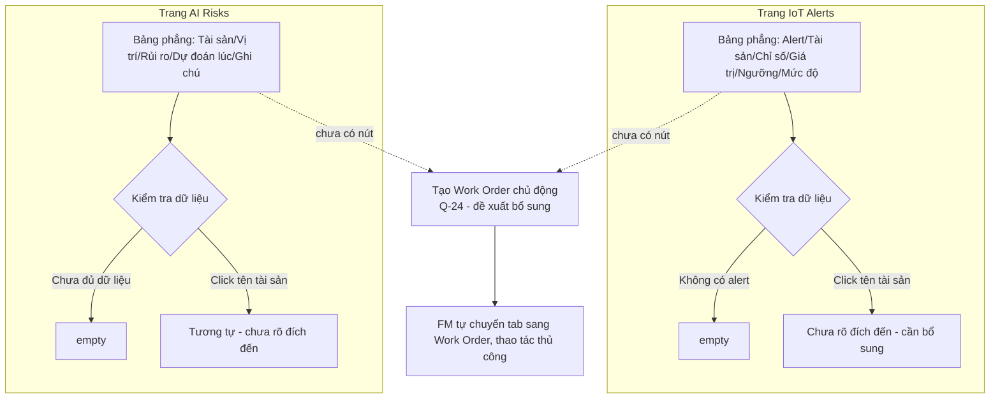

# Tài liệu Prototype & Usability Testing

## FLOW 1 — Requester: Báo cáo & theo dõi sự cố

* **UC:** UC-05, UC-06
* **US:** US-03-01, US-03-02
* **REQ:** REQ-02, REQ-03, REQ-04, REQ-05
* **BR:** BR-05, BR-14

### Persona
**Requester** (sinh viên/giảng viên/nhân viên) — Persona 01.  
> *"Báo lỗi nhanh – dễ theo dõi – biết được sự cố đang được xử lý đến đâu."*

### Mục tiêu
Requester phát hiện thiết bị hỏng, báo lỗi nhanh, và theo dõi được tiến độ xử lý ngay trên cùng một màn hình.

### Screen
**Trang "Yêu cầu sự cố"** — 1 trang, gồm 3 khối xếp dọc:
1. **Dải stat card:** Tổng / Chờ phân công / Đang xử lý / Hoàn thành / Từ chối
2. **Form báo cáo:** Dropdown *"1. Vị trí"* → Dropdown *"2. Thiết bị tại vị trí"* → Dòng xác nhận đã chọn → Textarea mô tả (giới hạn 500 ký tự, có counter) → Nút *"Gửi yêu cầu"*
3. **Bảng "Yêu cầu của tôi":** Cột Tài sản / Nội dung / Trạng thái (badge) / Thời gian

### States bắt buộc
`loading`, `empty` (chưa có yêu cầu nào), `error` (chưa chọn thiết bị hoặc thiếu mô tả — BR-05/AC-US-03-01-03), `confirmation` (toast + dòng mới thêm vào bảng), `success`

### Business Rule cần thể hiện đúng
* **BR-05:** Request phải xác định Asset hoặc khu vực bị ảnh hưởng.
* **BR-14 / AC-US-03-02-02:** 6 trạng thái chính thức: `Submitted` → `Pending` → `In Progress` → `Resolved` → `Closed`, hoặc nhánh `Submitted` → `Rejected`.

### Sample Data
* **Vị trí:** Bãi xe phía Nam — **Thiết bị:** Đèn LED bãi xe
* **Yêu cầu mẫu 1:** "Máy chiếu C201 hình bị cắt mép trên." — Status: *Chờ phân công*
* **Yêu cầu mẫu 2:** "Điều hòa A302 tối góc bảng, khó nhìn slide." — Status: *Đã phân công*

### [ASSUMPTION]
* Sau khi gửi thành công, không chuyển màn hình xác nhận riêng — thêm ngay 1 dòng mới vào bảng "Yêu cầu của tôi" kèm toast thông báo.
* Ảnh/video đính kèm: Không có trên form — cần xác nhận đây là quyết định có chủ đích hay cần bổ sung lại theo REQ-04.

---

## FLOW 2 — Facility Manager: Bảng điều phối Work Order

* **UC:** UC-07, UC-08
* **US:** US-03-03, US-03-04, US-04-01, US-04-02
* **REQ:** REQ-13, REQ-14, REQ-15
* **BR:** BR-05, BR-06, BR-07, BR-08, BR-18

### Persona
**Facility Manager** — Persona 03.  
> *"Có đầy đủ dữ liệu để biết tài sản nào đang có vấn đề... và cần hành động gì tiếp theo."*

### Mục tiêu
FM nhận một Request mới, phân công đúng Technician, và sau khi Work Order hoàn thành, xác nhận kết quả để đóng Request theo BR-18.

### Screen
**Trang "Work Order" (view Facility Manager)** — 3 khối xếp dọc:
1. **Dải 6 stat card:** Tổng WO / Chờ phân công / Đã phân công / Đang thực hiện / Hoàn thành / Đã hủy
2. **Khối "Phân công yêu cầu mới":** Dropdown *"Yêu cầu chờ phân công"* + Dropdown *"Kỹ thuật viên"* + Nút *"Từ chối"* (đỏ) + Nút *"Phân công"* (xanh)
3. **Bảng "Danh sách Work Order":** Cột Tài sản / Kỹ thuật viên / Trạng thái (badge) / Thời gian / Thao tác (dropdown đổi KT + nút Hủy)

### States bắt buộc
`empty` (không còn yêu cầu chờ phân công), `error` (Request đã có WO — BR-06; chưa chọn Technician — AC-US-04-02-02), `confirmation` (toast + dòng mới trong bảng)

### Business Rule cần thể hiện đúng
* **BR-06:** 1 Maintenance Request chỉ tạo tối đa 1 Work Order.
* **BR-18:** Request chỉ được Closed sau khi Facility Manager xác nhận kết quả.

### Sample Data
* **Yêu cầu chờ phân công:** "Đèn LED A302 — Phòng A302"
* **Kỹ thuật viên:** Hoàng Minh Bảo Trì, Lê Thị Sửa Chữa

### [ASSUMPTION]
* Việc "chọn yêu cầu" và "phân công Technician" gộp trong 1 khối duy nhất, thao tác 1 lần.
* Nút "Từ chối" ở khối phân công dùng để Facility Manager từ chối thẳng Maintenance Request (không tạo Work Order) — cần bổ sung Use Case/User Story mô tả riêng hành vi này, hiện chưa có trong tài liệu gốc.
* Cần bổ sung màn hình/thao tác "Xác nhận kết quả & Đóng yêu cầu" khi Work Order liên quan chuyển sang Hoàn thành (US-03-04, BR-18) — hiện chưa có trên UI.

---

## FLOW 3 — Technician: Danh sách Work Order được giao

* **UC:** UC-09, UC-10
* **US:** US-04-04, US-04-05, US-04-06
* **REQ:** REQ-17, REQ-18, REQ-19, REQ-20, REQ-21, REQ-22
* **BR:** BR-07, BR-08, BR-09, BR-10, BR-11, BR-17

### Persona
**Technician** — Persona 02.  
> *"Nhận đúng Work Order – có đủ thông tin thiết bị – xử lý hiệu quả – ghi nhận đầy đủ kết quả."*

### Mục tiêu
Technician xem Work Order được giao, bắt đầu xử lý hoặc từ chối kèm lý do, ghi nhận kết quả và hoàn thành.

### Screen
**Trang "Work Order" (view Technician)** — 2 khối:
1. **Dải stat card:** Tổng WO / Đã phân công / Đang thực hiện / Hoàn thành / Đã hủy
2. **Bảng "Danh sách Work Order":** Cột Tài sản / Kỹ thuật viên / Trạng thái / Thời gian / Thao tác — thao tác đổi theo trạng thái dòng:
   * **"Đã phân công":** Nút *"Bắt đầu"* + ô nhập *"Lý do từ chối"* + nút *"Từ chối"* (cùng hàng)
   * **"Đang thực hiện":** Ô nhập *"Kết quả bảo trì"* + nút *"Hoàn thành"*
   * **"Đã hủy":** Hiển thị ghi chú trạng thái kết thúc

### States bắt buộc
`empty`, `loading`, `error` (từ chối thiếu lý do — AC-US-04-05-03; thiếu kết quả khi hoàn thành — AC-US-04-06-03), `permission` (không xem/thao tác WO không phải của mình — AC-US-04-04-03), `confirmation` (inline, không chuyển trang)

### Business Rule cần thể hiện đúng
* **BR-17:** Work Order dùng vòng đời `Assigned` → `In Progress` → `Completed`/`Cancelled`.
* **BR-07:** Technician chỉ cập nhật WO được phân công cho mình.

### [ASSUMPTION]
* Khi Technician từ chối Work Order, status hiện chuyển sang "Đã hủy" — dùng chung nhãn với trường hợp Work Order bị hủy hẳn. Đây là điểm cần làm rõ: nên tách riêng thành trạng thái "Rejected" để phân biệt "từ chối, cần phân công lại" với "hủy hẳn, không ai xử lý nữa" — tránh rủi ro Work Order bị bỏ sót.

---

## FLOW 4 — Facility Manager: IoT Alerts & AI Risk Dashboard

* **UC:** UC-12, UC-13, UC-14, UC-15
* **US:** US-05-03, US-05-04, US-06-01, US-06-02
* **REQ:** REQ-09, REQ-10, REQ-11, REQ-12, REQ-28, REQ-29, REQ-30
* **BR:** BR-10, BR-11, BR-12, BR-13, BR-15

### Persona
**Facility Manager** — flow thể hiện rõ nhất giá trị AI/IoT của sản phẩm.

### Mục tiêu
FM xem cảnh báo IoT và dự đoán rủi ro AI để chủ động xác định thiết bị cần bảo trì.

### Screen
* **Trang "IoT Alerts":** Bảng phẳng — cột Alert / Tài sản / Chỉ số / Giá trị / Ngưỡng / Mức độ / Thời điểm.
* **Trang "AI Risks":** Bảng phẳng riêng — cột Tài sản / Vị trí / Rủi ro / Dự đoán lúc / Ghi chú.

### States bắt buộc
`loading`, `empty` (không có alert/risk nào), `error` (không nhận được dữ liệu IoT mới — UC-12 A2, hiển thị "không có dữ liệu mới" thay vì dữ liệu cũ), `empty` (không đủ dữ liệu để AI dự đoán — UC-14 A1)

### Business Rule cần thể hiện đúng
* **BR-10:** AI chỉ hỗ trợ quyết định, không tự tạo Work Order — không có hành động tự động nào từ AI trên 2 trang này.
* **UC-15 (bước 5):** Nếu actor là Technician xem màn này, chỉ hiển thị Asset liên quan Work Order được giao cho họ, không hiển thị toàn bộ danh sách như FM.

### Sample Data
* **Alert:** Đèn LED hành lang tầng 2 — Chỉ số: temperature — Giá trị: 42.8 — Ngưỡng: 40 — Mức: High
* **Risk:** Quạt trần C102 — Phòng C102 — Risk: High — Ghi chú: "Dữ liệu mẫu MVP"

### [ASSUMPTION]
* Chưa có liên kết trực tiếp từ 1 Alert/Risk sang hành động "Tạo Work Order" — Facility Manager cần tự chuyển sang trang Work Order và thao tác thủ công.
* Ngưỡng cụ thể hiển thị trên bảng (VD: temperature > 40) là số liệu minh họa cho MVP, cần xác nhận có phải giá trị chính thức không.
* Risk hiển thị dạng nhãn Low/Medium/High, không kèm % — cần xác nhận qua test xem người dùng có mong muốn thêm con số cụ thể không.

---

## Screen Flow Diagram (Mermaid)

### Flow 1 & 2 — Requester & Facility Manager Flow

### Flow 3 — Technician Work Order Flow

### Flow 4 — IoT Alerts & AI Risk Dashboard Flow

---

## Usability Test Script

* **Số người test:** 3 (tối thiểu)
* **Nguyên tắc:** Không giải thích cách dùng trước, không hỏi thích/không thích, chỉ quan sát hành vi.

### Câu mở đầu (đọc cho người test)
> *"Mình đang thử nghiệm một prototype cho hệ thống quản lý bảo trì cơ sở vật chất của trường, chưa phải sản phẩm hoàn chỉnh. Bạn cứ thao tác tự nhiên, mình không hướng dẫn trong lúc bạn làm, chỉ quan sát. Nếu bạn nghĩ thành tiếng thì càng tốt."*

### Task 1 — Flow 1: Requester — Trang "Yêu cầu sự cố"
* **Task đọc cho người test:** *"Điều hòa ở phòng bạn đang học bị hỏng, không mát. Hãy báo lỗi và cho biết yêu cầu của bạn đang ở trạng thái nào."*
* **Quan sát cần ghi:**
  * Có chọn đúng thứ tự 2 dropdown "Vị trí" → "Thiết bị" không?
  * Sau khi bấm "Gửi yêu cầu", có nhận biết được đã gửi thành công không (vì không có màn xác nhận riêng, chỉ có toast + dòng mới trong bảng)?
  * Có tự nhìn xuống bảng "Yêu cầu của tôi" để xác nhận không?
* **Thời gian hoàn thành:** `_____`
* **Kết quả:** `[ ] Có` `[ ] Không` `[ ] Một phần`

### Task 2 — Flow 2: Facility Manager — Trang "Work Order"
* **Task đọc cho người test:** *"Có một yêu cầu báo lỗi mới vừa gửi tới. Hãy phân công cho một kỹ thuật viên xử lý."*
* **Quan sát cần ghi:**
  * Có tìm đúng khối "Phân công yêu cầu mới" không?
  * Có bị nhầm giữa 2 nút "Từ chối" và "Phân công" đặt cạnh nhau không?
  * Nếu chú ý đến nút "Từ chối", họ hiểu nút này nghĩa là gì — từ chối yêu cầu hay từ chối phân công cho người này? (Ghi nguyên văn cách diễn giải.)
* **Thời gian hoàn thành:** `_____`
* **Kết quả:** `[ ] Có` `[ ] Không` `[ ] Một phần`

#### Task 2b:
* **Task đọc cho người test:** *"Giả sử kỹ thuật viên đã báo hoàn thành công việc này. Hãy tìm cách xác nhận và đóng yêu cầu lại."*
* **Quan sát cần ghi:** Người test có tìm được thao tác này không?

### Task 3 — Flow 3: Technician — Trang "Work Order"
* **Task đọc cho người test:** *"Bạn vừa được giao một công việc sửa chữa. Hãy bắt đầu xử lý, sau đó ghi nhận kết quả và hoàn thành."*
* **Quan sát cần ghi:**
  * Có nhận ra thao tác "Bắt đầu" nằm ngay trong dòng bảng không?
  * Sau khi bấm "Bắt đầu", có hiểu cần điền ô "Kết quả bảo trì" trước khi hoàn thành không?
* **Thời gian hoàn thành:** `_____`
* **Kết quả:** `[ ] Có` `[ ] Không` `[ ] Một phần`

#### Task 3b — Nhánh từ chối:
* **Task đọc cho người test:** *"Bạn nhận thấy một công việc khác không đúng chuyên môn của mình. Hãy từ chối và cho biết lý do."*
* **Thắc mắc sau từ chối:** Sau khi từ chối, dòng chuyển sang trạng thái "Đã hủy". Hỏi: *"Bạn nghĩ 'Đã hủy' ở đây nghĩa là gì — công việc bị hủy hẳn không ai làm nữa, hay chỉ là bạn từ chối và sẽ có người khác nhận?"* — ghi nguyên văn câu trả lời.

### Task 4 — Flow 4: Facility Manager — Trang "IoT Alerts" + "AI Risks"
* **Task đọc cho người test:** *"Hãy tìm xem thiết bị nào đang có cảnh báo bất thường, và thiết bị nào có nguy cơ hỏng cao nhất theo AI."*
* **Quan sát cần ghi:**
  * Có tự nhận ra cần xem 2 trang riêng biệt không?
  * Có thử click vào tên tài sản (dạng link) không? Nếu có, họ mong đợi điều gì?
  * Sau khi thấy 1 Asset có Risk = High, họ có tìm cách tạo Work Order cho nó không? Họ tự chuyển sang tab "Work Order" hay bị kẹt lại?
* **Thời gian hoàn thành:** `_____`
* **Kết quả:** `[ ] Có` `[ ] Không` `[ ] Một phần`

---

## Usability Findings

### Người test (mô phỏng)

| STT | Người test | Vai trò đóng | Ngày test | Ghi chú |
| :--- | :--- | :--- | :--- | :--- |
| 1 | Lê Thị Thanh Thảo | Requester | 04/09/2026 | Chưa dùng hệ thống quản lý bảo trì trước đây |
| 2 | Hồ Thị Thu Thảo | Facility Manager | 04/09/2026 | Chưa dùng hệ thống quản lý bảo trì trước đây |
| 3 | Đặng Như Trầm | Technician | 04/09/2026 | Chưa dùng hệ thống quản lý bảo trì trước đây |

### Bảng Observation → Issue → Decision

| # | Flow | Người test | Observation | Issue | Decision |
| :-: | :--- | :--- | :--- | :--- | :--- |
| **1** | Flow 1 | Thanh Thảo | Chọn đúng "Bãi xe phía Nam" → "Đèn LED bãi xe" theo đúng thứ tự 2 dropdown, không bị rối. | Không có issue | Không cần thay đổi |
| **2** | Flow 1 | Thanh Thảo | Sau khi bấm "Gửi yêu cầu", thấy toast hiện lên rồi biến mất nhanh, không chắc chắn đã gửi thành công cho tới khi tự cuộn xuống thấy dòng mới — nói: *"ủa gửi xong chưa ta, để coi lại danh sách"*. | Thiết kế "im lặng cập nhật" (toast + thêm dòng) chưa đủ rõ ràng | Giữ toast lâu hơn (4-5 giây), highlight dòng mới thêm vào bảng bằng màu nền tạm thời 2-3 giây |
| **3** | Flow 2 | Thu Thảo | Nhìn thấy 2 nút "Từ chối" và "Phân công" cạnh nhau, dừng lại hỏi: *"từ chối là từ chối luôn cái yêu cầu này hả, hay là không muốn giao cho người này?"*. | 2 nút cạnh nhau gây mơ hồ về phạm vi hành động "Từ chối" | Cần làm rõ nghĩa "Từ chối" (Q-22), tách biệt trực quan hơn hoặc thêm tooltip |
| **4** | Flow 2 | Thu Thảo | Không tìm được cách "đóng yêu cầu" ở Task 2b, sau ~20 giây bỏ cuộc, nói: *"chắc tự động đóng luôn khi xong á"*. | Chưa có UI cho bước xác nhận & đóng Request (US-03-04, BR-18) | Cần bổ sung UI cho bước này |
| **5** | Flow 3 | Trầm | Bấm "Bắt đầu" đúng dòng, sau đó thấy ô nhập "Kết quả bảo trì" xuất hiện ngay trong dòng, tự nhập và bấm "Hoàn thành" mà không cần hướng dẫn. | Không có issue | Không cần thay đổi |
| **6** | Flow 3 | Trầm | (Task 3b — OQ-01) Xem chi tiết bên dưới. | Xem bên dưới | Xem bên dưới |
| **7** | Flow 4 | Thu Thảo | Ban đầu tưởng "IoT Alerts" và "AI Risks" là cùng 1 trang, bấm qua lại vài lần mới nhận ra là 2 nguồn thông tin khác nhau. | Tách 2 trang riêng gây mất thời gian định hướng ban đầu | Cân nhắc gộp lại hoặc liên kết rõ hơn giữa 2 trang (Q-24) |
| **8** | Flow 4 | Thu Thảo | Thấy "Quạt trần C102" có Risk = High, thử click vào tên (link gạch chân) — không có gì xảy ra, sau đó tự mở tab "Work Order" và nói: *"chắc phải tự qua đây tạo thủ công"*. | Thiếu liên kết trực tiếp từ Risk sang hành động tạo Work Order, nhưng người dùng vẫn tự suy luận được | Ghi nhận cho Q-24, không phải lỗi chặn hoàn toàn |

### Tỷ lệ hoàn thành task (Task completion rate)

| Flow | Thanh Thảo | Thu Thảo | Trầm | Tỷ lệ hoàn thành |
| :--- | :-: | :-: | :-: | :-: |
| **Flow 1 — UC-05/06** | X | — | — | **1/1** |
| **Flow 2 — UC-07/08** | — | / *(Task 2 xong, Task 2b không hoàn thành)* | — | **1/2** |
| **Flow 3 — UC-09** | — | — | X | **1/1 (một phần)** |
| **Flow 4 — UC-12→15** | — | X *(chậm hơn dự kiến)* | — | **1/1** |

> **Ghi chú:** `X` = hoàn thành, `0` = không hoàn thành, `/` = hoàn thành một phần.  
> Mỗi người chỉ được giao 1-2 flow phù hợp vai trò đóng, theo đúng persona.

### Top vấn đề cần xử lý ngay (ưu tiên theo mức độ nghiêm trọng)
1. **[Nghiêm trọng nhất] OQ-01:** Technician hiểu nhầm ý nghĩa trạng thái "Đã hủy" sau khi từ chối Work Order.
2. **[Nghiêm trọng] Flow 2:** Thiếu hẳn UI cho bước "Xác nhận kết quả & Đóng yêu cầu" (US-03-04, BR-18). Task 2b thất bại hoàn toàn.
3. **Q-22:** 2 nút "Từ chối"/"Phân công" cạnh nhau gây mơ hồ về phạm vi hành động.
4. **Flow 1:** Thiết kế "im lặng cập nhật" sau khi gửi yêu cầu chưa đủ rõ ràng.
5. **Q-24:** Thiếu liên kết giữa IoT Alerts/AI Risks và hành động tạo Work Order (mức độ nhẹ).

---

### Kết quả quan trọng nhất: OQ-01 — Work Order Rejection Status
* **Task 3b:** Trầm từ chối 1 Work Order khác, thấy dòng đó chuyển sang "Đã hủy".
* Khi được hỏi *" 'Đã hủy' ở đây nghĩa là gì?"*, Trầm trả lời: *"Chắc là xong luôn rồi, không ai làm cái này nữa hả? Nhưng ủa lỡ tôi từ chối mà đâu có nghĩa là cái việc đó không cần làm nữa đâu, người khác vẫn phải làm chứ."*
* **Nhận xét:** Trầm nhận ra ngay sự mâu thuẫn logic: "Đã hủy" thường hiểu là "không cần làm nữa", nhưng thực tế ý định là "tôi từ chối, cần người khác làm" — hai ý nghĩa trái ngược nhau nhưng đang dùng chung 1 nhãn.

#### Đề xuất hướng resolve OQ-01:
* [ ] **Phương án 1:** Reject chỉ là action, WO giữ nguyên Assigned.
* [x] **Phương án 2 (đề xuất):** Tách `Rejected` thành Work Order Status riêng biệt, khác với `Cancelled`.
  * *Lý do:* Rủi ro thực tế là Work Order bị bỏ sót nếu Facility Manager không chủ động kiểm tra lại — không chỉ là vấn đề trải nghiệm mà có thể ảnh hưởng đến vận hành thật.
  * *Lưu ý:* Đây là đề xuất dựa trên dữ liệu mô phỏng cỡ mẫu rất nhỏ (n=1) — cần stakeholder/giảng viên xác nhận chính thức trước khi cập nhật BR-17.

---

### Open Questions khác được resolve nhờ test này

| Open Question ID | Nội dung | Kết quả từ test | Đề xuất |
| :--- | :--- | :--- | :--- |
| **Q-01** | Requester xem Asset theo phòng hay toàn bộ? | Không phát sinh vấn đề trong test — chưa đủ dữ liệu để kết luận chắc chắn. | **Giữ Open**, cần test thêm với nhiều Asset hơn. |
| **Q-02** | Ảnh có bắt buộc không? | Không thể test — UI hiện không có tính năng đính kèm ảnh. | **Giữ Open**, cần xác nhận đây là quyết định có chủ đích hay thiếu sót khi build. |
| **Q-05** | FM có cần approve riêng trước khi tạo WO? | Thu Thảo tự nhiên đọc kỹ nội dung trước khi tạo WO mà không cần nút "Approve" tách riêng. | **Đề xuất Resolved:** Không cần bước approve riêng, gộp chung với hành động Tạo/Phân công như hiện tại. |
| **Q-08** | FM có cần xác nhận trước khi đóng Request? | Test được lần đầu (Task 2b) — thất bại hoàn toàn, xác nhận UI thiếu. | **Giữ Open**, ưu tiên bổ sung tính năng. |
| **Q-13** | Risk hiển thị Low/Medium/High hay kèm %? | Chưa test lại lần này. | **Giữ Open** |
| **Q-22 (mới)** | Nút "Từ chối" ở khối phân công của FM nghĩa là gì? | Thu Thảo bối rối thật khi thấy 2 nút cạnh nhau. | **Open — Ưu tiên cao** |
| **Q-23 (mới)** | Ngưỡng cụ thể hiển thị trên UI đã chính thức hay tạm thời? | Chưa test trực tiếp. | **Open** |
| **Q-24 (mới)** | Cần liên kết trực tiếp Risk/Alert → tạo Work Order không? | Thu Thảo tự xoay sở được nhưng mất thời gian định hướng. | **Open** |

---

### Hạn chế của đợt test mô phỏng này (cần nêu rõ khi báo cáo)
1. **Cỡ mẫu rất nhỏ:** Chỉ 1 người/vai trò, mỗi flow chỉ được test 1 lần — không đủ để kết luận thống kê, chỉ đủ để phát hiện tín hiệu ban đầu.
2. **Task 2b thất bại:** Không phải vì hành vi người dùng sai, mà vì bản thân UI chưa có tính năng đó — đây là "gap tính năng" chứ không phải vấn đề usability thuần túy.
3. **Dữ liệu mô phỏng:** Không phải người dùng thật của Trường Đại học Kinh tế – Đại học Đà Nẵng — khi triển khai thật, cần lặp lại quy trình này với đúng đối tượng.

---

## Decision Log

### DEC-09 — Đề xuất bổ sung trạng thái Rejected cho Work Order
* **Ngày:** 10/09/2026
* **Người tham gia:** Project Owner (mô phỏng), dựa trên usability test mô phỏng với Đặng Như Trầm (Technician)
* **UC/US liên quan:** UC-09, UC-10, US-04-05 | **BR liên quan:** BR-17 | **Open Question:** OQ-01
* **Vấn đề:** Khi Technician từ chối Work Order, hệ thống hiện set status = "Đã hủy" — dùng chung nhãn với trường hợp Work Order bị hủy hẳn. Usability test cho thấy điều này gây hiểu nhầm nghiêm trọng: người dùng đọc "Đã hủy" và hiểu là "không ai cần làm nữa", trong khi ý định thực tế là "cần người khác làm" — hai nghĩa trái ngược nhau, có rủi ro thực tế khiến Work Order bị bỏ sót.
* **Quyết định (đề xuất):** Bổ sung `Rejected` thành Work Order Status riêng biệt, tách khỏi `Cancelled`.  
  * *Vòng đời đề xuất:* `Assigned` → `In Progress` → `Completed`/`Cancelled`, thêm nhánh `Assigned` → `Rejected` → (quay lại hàng chờ phân công).
* **Ảnh hưởng:** BR-17, UC-09/10, US-04-05.
* **Trạng thái:** **Proposed** — Ưu tiên Cao. Cỡ mẫu nhỏ (n=1), cần xác nhận thêm nhưng nên ưu tiên xử lý sớm vì ảnh hưởng trực tiếp đến UI đã build.

### DEC-10 — Xác nhận cần làm rõ chủ trương về tính năng đính kèm ảnh
* **Ngày:** 10/09/2026
* **Người tham gia:** Project Owner (mô phỏng)
* **REQ liên quan:** REQ-04 | **Open Question:** Q-02
* **Vấn đề:** REQ-04 xác nhận ảnh/video không bắt buộc khi tạo Maintenance Request. Tuy nhiên, hệ thống hiện không có tính năng đính kèm ảnh trên form — không thể test hành vi người dùng đối với tính năng này.
* **Quyết định (đề xuất):** Cần xác nhận với đội kỹ thuật: việc không có tính năng ảnh là quyết định có chủ đích (VD: ưu tiên MVP tối giản) hay thiếu sót khi implement so với REQ-04. Nếu là chủ đích, cần cập nhật lại REQ-04; nếu là thiếu sót, cần bổ sung vào UI.
* **Ảnh hưởng:** Q-02, REQ-04.
* **Trạng thái:** **Proposed** — cần làm rõ với đội dev trước khi resolve.

### DEC-11 — Xác nhận không cần bước "Approve" tách riêng trước khi tạo Work Order
* **Ngày:** 10/09/2026
* **Người tham gia:** Project Owner (mô phỏng), dựa trên usability test mô phỏng với Hồ Thị Thu Thảo (Facility Manager)
* **REQ liên quan:** REQ-13, REQ-14 | **UC liên quan:** UC-07, UC-08 | **Open Question:** Q-05
* **Vấn đề:** Q-05 hỏi liệu Facility Manager có cần bước "approve" Request tách biệt trước khi tạo Work Order không.
* **Quyết định (đề xuất):** Không cần bước approve riêng. Khối "Phân công yêu cầu mới" (gộp chung việc chọn Request + tạo Work Order) phù hợp với hành vi quan sát được — người dùng tự đọc kỹ nội dung trước khi bấm Phân công.
* **Ảnh hưởng:** Q-05.
* **Trạng thái:** **Proposed**.

### DEC-12 — Nút "Từ chối" ở khối phân công cần làm rõ phạm vi hành động
* **Ngày:** 10/09/2026
* **Người tham gia:** Project Owner (mô phỏng), dựa trên usability test mô phỏng với Hồ Thị Thu Thảo
* **UC liên quan:** UC-07, UC-08 | **Open Question mới:** Q-22
* **Vấn đề:** Hệ thống có nút "Từ chối" đặt cạnh nút "Phân công" ở khối phân công yêu cầu — hành vi này chưa từng được mô tả trong UC-07/UC-08 gốc. Usability test cho thấy Facility Manager bối rối thật về ý nghĩa: từ chối yêu cầu hay từ chối phân công cho người này.
* **Quyết định (đề xuất):** Cần bổ sung Use Case/User Story mới mô tả rõ hành vi "Facility Manager từ chối thẳng Maintenance Request" (khác với Technician từ chối Work Order đã phân công — đó là OQ-01, một vấn đề khác). Đề xuất đổi label nút thành cụ thể hơn, ví dụ "Từ chối yêu cầu" thay vì chỉ "Từ chối".
* **Ảnh hưởng:** Cần thêm UC/US mới cho hành vi này.
* **Trạng thái:** **Proposed** — cần Business Analyst bổ sung UC/US chính thức.
