# Data Requirements & Database Model

## 1. Entity-Relationship Diagram (ERD)

```mermaid
erDiagram
    USERS ||--o{ MAINTENANCE_REQUESTS : creates
    USERS ||--o{ WORK_ORDERS : assigned_to
    ASSETS ||--o{ MAINTENANCE_REQUESTS : relates_to
    ASSETS ||--o{ WORK_ORDERS : has
    ASSETS ||--o| IOT_MAPPINGS : mapped_via
    ASSETS ||--o{ MAINTENANCE_HISTORY : records
    ASSETS ||--o{ AI_PREDICTIONS : has
    IOT_DEVICES ||--o| IOT_MAPPINGS : connects
    IOT_DEVICES ||--o{ IOT_DATA : generates
    IOT_DATA ||--o{ IOT_ALERTS : triggers
    WORK_ORDERS ||--o| MAINTENANCE_HISTORY : results_in

    USERS {
        int UserID PK
        varchar Username
        varchar PasswordHash
        varchar Role "Requester, Technician, FacilityManager, Admin"
        boolean IsActive "Default: true — dùng để vô hiệu hoá tài khoản thay vì xóa"
    }

    ASSETS {
        int AssetID PK
        varchar Name
        varchar Type "Wi-Fi, Air Conditioner, Projector, Light, Fan"
        varchar Location
        varchar Status "Operational, Warning, Maintenance, Out of Service"
    }

    MAINTENANCE_REQUESTS {
        int RequestID PK
        int RequesterID FK
        int AssetID FK
        varchar Description
        varchar Status "Submitted, Pending, In Progress, Resolved, Closed, Rejected"
        datetime CreatedAt
    }

    WORK_ORDERS {
        int OrderID PK
        int RequestID FK
        int TechnicianID FK
        int AssetID FK
        varchar Status "Assigned, In Progress, Completed, Cancelled"
        varchar RejectionReason "Nullable — ghi lý do Technician từ chối"
        datetime CreatedAt
    }

    MAINTENANCE_HISTORY {
        int HistoryID PK
        int WorkOrderID FK
        int AssetID FK
        varchar Result "Kết quả bảo trì — bắt buộc có (BR-09)"
        datetime CompletedAt "Server-side timestamp, không tin client"
    }

    IOT_DEVICES {
        varchar DeviceID PK "Mã định danh thiết bị IoT, ví dụ: SENSOR-WIFI-P201"
        varchar DeviceName
        varchar DeviceType "Loại cảm biến: temperature, signal_strength, power_status..."
    }

    IOT_MAPPINGS {
        int MappingID PK
        int AssetID FK "Unique — một Asset chỉ có một Mapping (BR-13)"
        varchar DeviceID FK "Unique — một Device chỉ thuộc một Asset (BR-13)"
        datetime CreatedAt
    }

    IOT_DATA {
        int DataID PK
        varchar DeviceID FK
        varchar MetricType "temperature, humidity, signal_strength, power_status, ..."
        float ReadingValue
        datetime Timestamp "Server-side timestamp"
    }

    IOT_ALERTS {
        int AlertID PK
        int DataID FK "Liên kết tới IOT_DATA gây ra Alert"
        int AssetID FK "Resolve từ IOT_MAPPINGS tại thời điểm Alert"
        varchar MetricType
        float ReadingValue
        float Threshold "Ngưỡng bất thường đã cấu hình theo Asset Type"
        varchar Severity "Low, Medium, High"
        datetime DetectedAt "Server-side timestamp"
    }

    AI_PREDICTIONS {
        int PredictionID PK
        int AssetID FK
        varchar RiskLevel "Low, Medium, High"
        datetime PredictedAt "Server-side timestamp"
        boolean BasedOnSampleData "true nếu dùng dữ liệu mẫu/giả lập trong MVP (BR-11)"
    }
```

---

## 2. Mô tả chi tiết các Table

### USERS
| Column | Type | Constraint | Ghi chú |
|--------|------|------------|---------|
| `UserID` | INT | PK, Auto-increment | |
| `Username` | VARCHAR(100) | NOT NULL, UNIQUE | |
| `PasswordHash` | VARCHAR(255) | NOT NULL | BCrypt hash, không lưu plaintext |
| `Role` | VARCHAR(50) | NOT NULL | `Requester`, `Technician`, `FacilityManager`, `Admin` |
| `IsActive` | BIT | NOT NULL, DEFAULT 1 | **Bổ sung từ US-01-03** — soft-disable tài khoản thay vì DELETE |

>  **Bổ sung từ US-01-03:** Cột `IsActive` thay thế cho việc xóa vĩnh viễn tài khoản trong MVP. Mọi query liên quan đến authentication và authorization phải filter `IsActive = 1`.

---

### ASSETS
| Column | Type | Constraint | Ghi chú |
|--------|------|------------|---------|
| `AssetID` | INT | PK, Auto-increment | |
| `Name` | VARCHAR(200) | NOT NULL | |
| `Type` | VARCHAR(100) | NOT NULL | `Wi-Fi`, `Air Conditioner`, `Projector`, `Light`, `Fan` |
| `Location` | VARCHAR(200) | NOT NULL | |
| `Status` | VARCHAR(50) | NOT NULL, DEFAULT `Operational` | `Operational`, `Warning`, `Maintenance`, `Out of Service` |

---

### MAINTENANCE_REQUESTS
| Column | Type | Constraint | Ghi chú |
|--------|------|------------|---------|
| `RequestID` | INT | PK, Auto-increment | |
| `RequesterID` | INT | FK → USERS(UserID), NOT NULL | |
| `AssetID` | INT | FK → ASSETS(AssetID), NULLABLE | NULL nếu ban đầu chỉ chỉ định khu vực (BR-05) |
| `Description` | TEXT | NOT NULL | |
| `Status` | VARCHAR(50) | NOT NULL, DEFAULT `Submitted` | `Submitted`, `Pending`, `In Progress`, `Resolved`, `Closed`, `Rejected` |
| `CreatedAt` | DATETIME | NOT NULL, DEFAULT NOW() | Server-side timestamp |

---

### WORK_ORDERS
| Column | Type | Constraint | Ghi chú |
|--------|------|------------|---------|
| `OrderID` | INT | PK, Auto-increment | |
| `RequestID` | INT | FK → MAINTENANCE_REQUESTS(RequestID), NULLABLE | NULL nếu FM tạo WO trực tiếp không qua Request |
| `TechnicianID` | INT | FK → USERS(UserID), NULLABLE | Được gán khi phân công (US-04-02) |
| `AssetID` | INT | FK → ASSETS(AssetID), NOT NULL | BR-08: WO phải liên kết Asset cụ thể |
| `Status` | VARCHAR(50) | NOT NULL, DEFAULT `Assigned` | `Assigned`, `In Progress`, `Completed`, `Cancelled` |
| `RejectionReason` | VARCHAR(500) | NULLABLE | Ghi khi Technician từ chối (US-04-05) |
| `CreatedAt` | DATETIME | NOT NULL, DEFAULT NOW() | Server-side timestamp |

---

### MAINTENANCE_HISTORY
| Column | Type | Constraint | Ghi chú |
|--------|------|------------|---------|
| `HistoryID` | INT | PK, Auto-increment | |
| `WorkOrderID` | INT | FK → WORK_ORDERS(OrderID), NOT NULL, UNIQUE | Một WO chỉ có một History record |
| `AssetID` | INT | FK → ASSETS(AssetID), NOT NULL | Denormalized từ WO để query History theo Asset |
| `Result` | TEXT | NOT NULL | **BR-09:** Bắt buộc có nội dung — Technician nhập mô tả kết quả |
| `CompletedAt` | DATETIME | NOT NULL | Server-side timestamp, không tin client (NFR-04) |

>  **Bổ sung từ phân tích Spec:** Bảng `MAINTENANCE_HISTORY` với cột `Result`, `AssetID`, `CompletedAt` được xác nhận rõ ràng từ US-04-06 (BR-09). `AssetID` denormalized để hỗ trợ query `GET /api/assets/{id}/prediction` hiệu quả mà không cần join nhiều bảng.

---

### IOT_DEVICES
| Column | Type | Constraint | Ghi chú |
|--------|------|------------|---------|
| `DeviceID` | VARCHAR(100) | PK | Mã định danh thiết bị, ví dụ: `SENSOR-WIFI-P201` |
| `DeviceName` | VARCHAR(200) | NULLABLE | Tên mô tả thiết bị |
| `DeviceType` | VARCHAR(100) | NULLABLE | Loại cảm biến: `temperature_sensor`, `wifi_analyzer`, ... |

>  **Bổ sung từ US-05-01/05-02:** Bảng `IOT_DEVICES` cần tồn tại trước khi mapping có thể được tạo. Admin phải có khả năng xem danh sách Device để chọn khi tạo Mapping.

---

### IOT_MAPPINGS
| Column | Type | Constraint | Ghi chú |
|--------|------|------------|---------|
| `MappingID` | INT | PK, Auto-increment | |
| `AssetID` | INT | FK → ASSETS(AssetID), NOT NULL, **UNIQUE** | **BR-13:** Một Asset chỉ có một Mapping |
| `DeviceID` | VARCHAR(100) | FK → IOT_DEVICES(DeviceID), NOT NULL, **UNIQUE** | **BR-13:** Một Device chỉ thuộc một Asset |
| `CreatedAt` | DATETIME | NOT NULL, DEFAULT NOW() | Server-side timestamp |

>  **UNIQUE constraints là bắt buộc** cho cả `AssetID` và `DeviceID` để enforce BR-13 ở tầng database, không chỉ ở application layer.

---

### IOT_DATA
| Column | Type | Constraint | Ghi chú |
|--------|------|------------|---------|
| `DataID` | INT | PK, Auto-increment | |
| `DeviceID` | VARCHAR(100) | FK → IOT_DEVICES(DeviceID), NOT NULL | |
| `MetricType` | VARCHAR(100) | NOT NULL | `temperature`, `humidity`, `signal_strength`, `power_status`, ... |
| `ReadingValue` | FLOAT | NOT NULL | Giá trị đo được |
| `Timestamp` | DATETIME | NOT NULL | Server-side timestamp (NFR-04), không tin Gateway timestamp |

---

### IOT_ALERTS *(Bảng mới — bổ sung từ US-05-04)*
| Column | Type | Constraint | Ghi chú |
|--------|------|------------|---------|
| `AlertID` | INT | PK, Auto-increment | |
| `DataID` | INT | FK → IOT_DATA(DataID), NOT NULL | IOT_DATA record gây ra Alert |
| `AssetID` | INT | FK → ASSETS(AssetID), NOT NULL | Resolve từ IOT_MAPPINGS tại thời điểm Alert |
| `MetricType` | VARCHAR(100) | NOT NULL | Loại metric bất thường |
| `ReadingValue` | FLOAT | NOT NULL | Giá trị gây ra Alert |
| `Threshold` | FLOAT | NOT NULL | Ngưỡng cấu hình theo Asset Type đã vi phạm |
| `Severity` | VARCHAR(20) | NOT NULL | `Low`, `Medium`, `High` |
| `DetectedAt` | DATETIME | NOT NULL | Server-side timestamp |

>  **Bổ sung hoàn toàn từ US-05-04:** Bảng `IOT_ALERTS` là bảng độc lập (không chỉ đánh dấu trong `IOT_DATA`). Lý do: (1) Cần truy vấn nhanh danh sách Alert cho FM mà không scan toàn bộ IOT_DATA; (2) Lưu `Threshold` tại thời điểm Alert để audit trail dù cấu hình threshold thay đổi sau đó.

---

### AI_PREDICTIONS
| Column | Type | Constraint | Ghi chú |
|--------|------|------------|---------|
| `PredictionID` | INT | PK, Auto-increment | |
| `AssetID` | INT | FK → ASSETS(AssetID), NOT NULL | |
| `RiskLevel` | VARCHAR(20) | NOT NULL | `Low`, `Medium`, `High` |
| `PredictedAt` | DATETIME | NOT NULL | Server-side timestamp (NFR-08) |
| `BasedOnSampleData` | BIT | NOT NULL, DEFAULT 0 | **Bổ sung từ US-06-03/BR-11** — `true` nếu AI dùng dữ liệu mẫu trong MVP |

>  **Bổ sung từ US-06-02/06-03 (BR-11, NFR-08):** Cột `BasedOnSampleData` cần thiết để hệ thống thông báo cho người dùng khi AI Prediction chạy trên dữ liệu giả lập (MVP). `PredictedAt` bắt buộc là server-side timestamp để tính toán độ "stale" của Prediction.

---

## 3. Index khuyến nghị

| Table | Column(s) | Lý do |
|-------|-----------|-------|
| `MAINTENANCE_REQUESTS` | `RequesterID` | Filter Request theo Requester (US-03-02) |
| `MAINTENANCE_REQUESTS` | `Status` | Filter Request theo Status lifecycle |
| `WORK_ORDERS` | `TechnicianID` | Filter WO theo Technician (US-04-04) |
| `WORK_ORDERS` | `RequestID` | Join WO ↔ Request khi validate BR-18 |
| `MAINTENANCE_HISTORY` | `AssetID` | Query History theo Asset (US-04-04) |
| `IOT_DATA` | `DeviceID, Timestamp` | Query IoT data gần nhất theo Device |
| `IOT_ALERTS` | `AssetID, DetectedAt` | Query Alert theo Asset, sort theo thời gian |
| `AI_PREDICTIONS` | `AssetID, PredictedAt` | Query Prediction gần nhất theo Asset |
